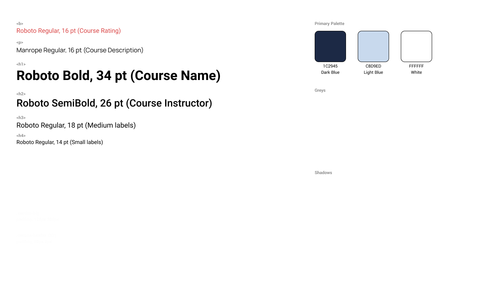
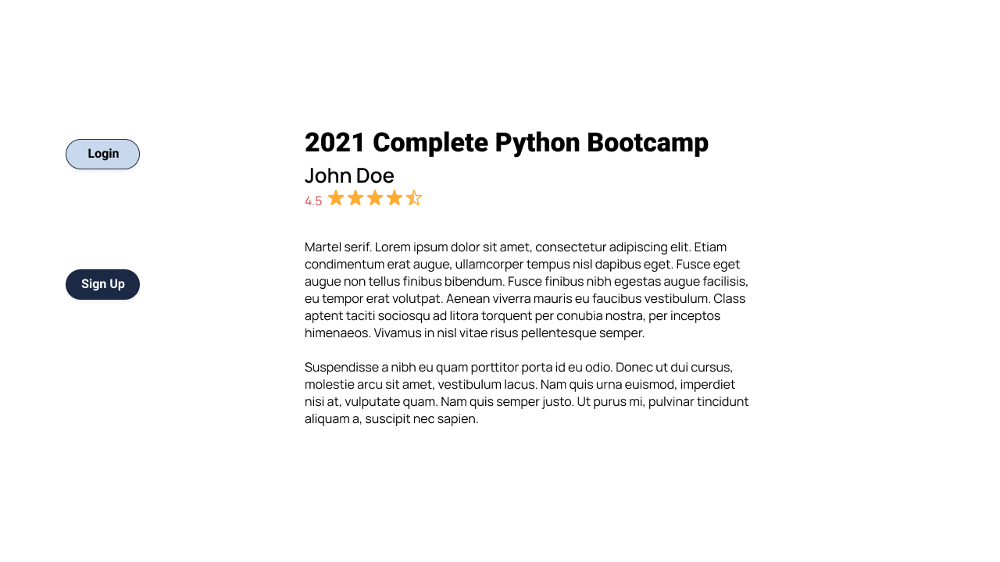
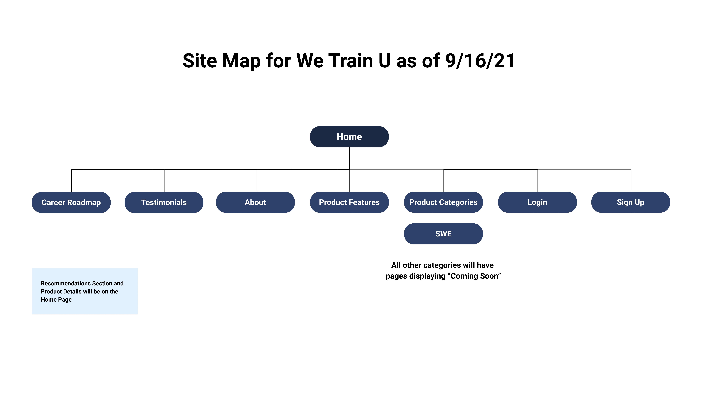

# We Train U

We Train U is an online learning and teaching platform for students looking to switch their career paths. 

# Technology Used

- Front-end:
  - HTML
  - CSS
  - Bootstrap
  - Vanilla JavaScript
- Design:
  - Figma

# How to Run the App

TBD

# Features
This project includes:
- Home Page
  - Hero Section
  - Product Features
  - Testimonials
  - Product Categories
  - "Start Your Journey Here" (Call to Action)
- About Page
  - Hero Section with a Testimonial
  - Section about We Train U
  - Contact Us Button
- Login and Signup Page
- Product Categories
  - Web Development is the only interactive section.
  - All other categories are coming soon.

# Design System
We Train U's design system is a library of reuasble components served as a guide to maintain efficiency and consistency when building our website.

# Site Map
This sitemap lists the pages of We Train U's website. Our team used this during the planning of our website's structure.

# Figma - Design
Our team utilized Figma to design mock-ups of active webpages before development. Mock-Ups are made available for view by visiting this [link](https://www.figma.com/file/tyePR4TZbI1fXEQCzFPheX/?node-id=0%3A1). 

The Figma contains the following three pages:
- Iterations of the Website
 - Home Page Mock-Ups (High Fidelity and Medium Fidelity)
 - About Us
 - Login and Sign-Up Pages
 - Product Categories
   - Note: Our initial plan was to have Product Categories showcase Software Engineering as the only interactive link for MVP. 
- Design System
- Site Map

# Future Features
- Interactive Product Categories
  - Products available for learning in specific categories, including Web Development, Marketing, Business, and Design.
- Interative Product Features
  - A section that features products recommended by students.
- Chat Features
  - For students to interact with professionals in the field of their choice.
- Links to Youtube Videos
  - Videos created by We Train U for students as an addition to their studies.
- Resources Section
  - Information provided by industries related to specific career fields to guide and inspire students.
- Profile Matching
  - A tool for students to network with Professionals.
- Career Road-Map
  - A guide for students on their journey to reach their career destination.

# Voyage 33 (Toucans Team 2) Contributors
- UX Engineer: [Alyssa Benipayo](https://github.com/alyssabenipayo)
- Front-end Developer:
  - [Jim Rogers](https://github.com/EnvoyPrototype)
  - [Seth Starr](https://github.com/Simon51584)
  - [Tian Xia](https://github.com/AllenXT)